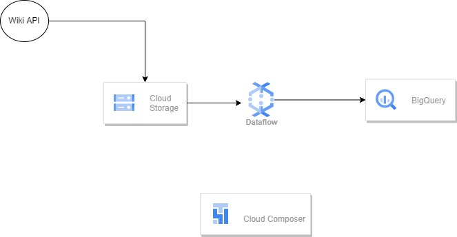
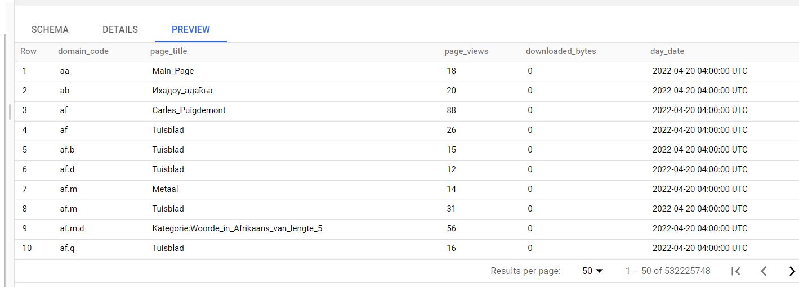
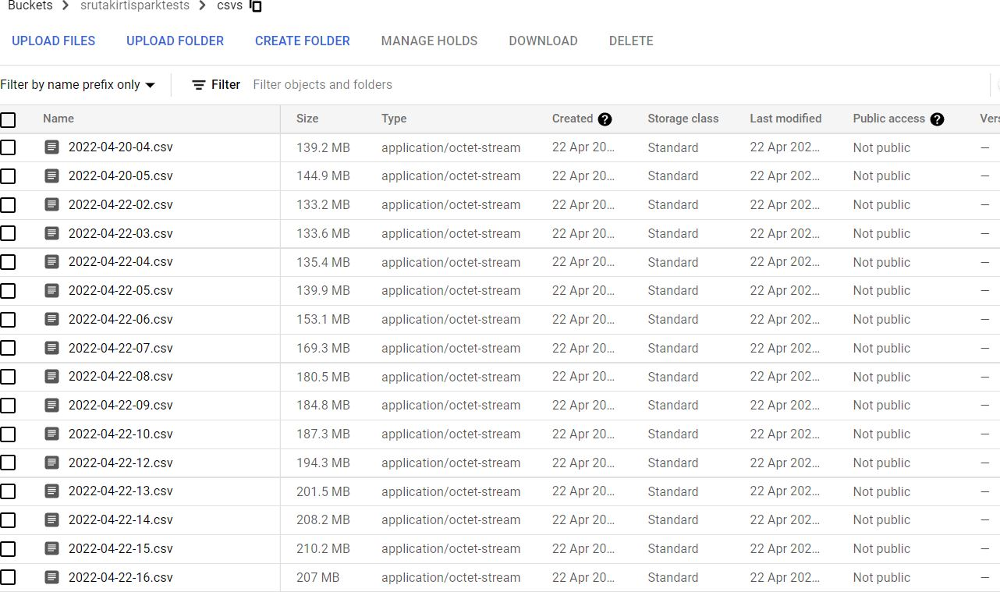

# airflowhttptoBQDataflow

## Arch

## Whats this project about?
This project uses Composer/Airflow to implement the following workflow:
* Data Source -Api call for getting the wikipage view data, uncompressing the zip and dumping into gcs.
* DataTransform - Apache beam is used to read the data , add an attribute and write it to BQ.
* DataSink - BigQQuery
* Orchestrator - Airflow/Composer

## Details about each Stage

### Sourcing the Data

The data pulled is a gzip file, the file is uncompressed in the /tmp folder and the gcp storage client library is is used to upload the blob to gcs.The file is named 
as per the hour for which the zip holds the data, uncompressed file is written as csv to gcs.

### Processing the Data using Beam (Python SDK)

This process uses a apache beam custom template to process the data and add the day-hour attribute from the file name itself.

### Loading the Data ot DataSink

The data is dumped into Datalake on hourly basis using the beam batch job.

### data sample

#### BQ

#### CSV samples

